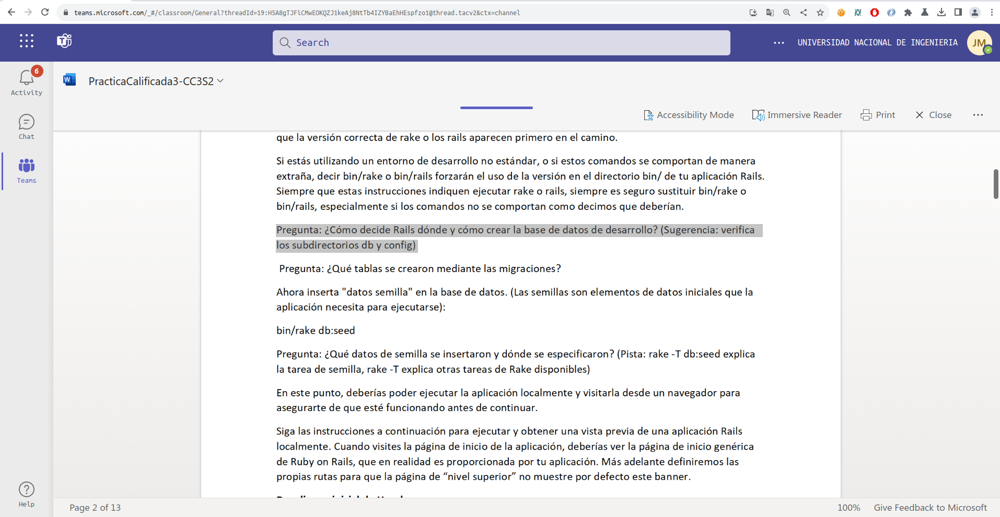

# Proceso y Respuestas

## Iniciando la aplicación

- Pregunta: ¿Cómo decide Rails dónde y cómo crear la base de datos de desarrollo? (Sugerencia: verifica los subdirectorios db y config)

En el directorio `config/` se encuentra el archivo `database.yml`, con el siguiente código

```yml
development:
  <<: *default
  database: db/development.sqlite3
```

Podemos ver que efectimante `development.sqlite3` se encuentra en el directorio `db/`, y mediante migraciones esta base de datos se crea y se actualiza.

- Pregunta: ¿Qué tablas se crearon mediante las migraciones? 

Se creó la tabla `movies`, ya que es la única tabla que esta descrita en la migración `CreateMovies`. 

- Pregunta: ¿Qué datos de semilla se insertaron y dónde se especificaron? (Pista: rake -T db:seed explica la tarea de semilla, rake -T explica otras tareas de Rake disponibles)

El archivo db/seeds.rb contiene un conjunto de datos de semilla que se cargarán en la base de datos cuando ejecutamos bundle exec rake db:seed.
En este caso, se están creando varias películas con sus títulos, clasificaciones y fechas de lanzamiento. Al ejecutar el comando `sqlite3 db/development.sqlite3` accedemos a una herramienta de comandos SQLite.

```sql
sqlite> .tables
movies             schema_migrations
sqlite> SELECT * FROM movies;
1|Aladdin|G||1992-11-25 00:00:00.000000|2023-11-15 23:38:51.047374|2023-11-15 23:38:51.047374
2|The Terminator|R||1984-10-26 00:00:00.000000|2023-11-15 23:38:51.060490|2023-11-15 23:38:51.060490
3|When Harry Met Sally|R||1989-07-21 00:00:00.000000|2023-11-15 23:38:51.063237|2023-11-15 23:38:51.063237
4|The Help|PG-13||2011-08-10 00:00:00.000000|2023-11-15 23:38:51.065822|2023-11-15 23:38:51.065822
5|Chocolat|PG-13||2001-01-05 00:00:00.000000|2023-11-15 23:38:51.068132|2023-11-15 23:38:51.068132
6|Amelie|R||2001-04-25 00:00:00.000000|2023-11-15 23:38:51.070353|2023-11-15 23:38:51.070353
7|2001: A Space Odyssey|G||1968-04-06 00:00:00.000000|2023-11-15 23:38:51.072732|2023-11-15 23:38:51.072732
8|The Incredibles|PG||2004-11-05 00:00:00.000000|2023-11-15 23:38:51.074942|2023-11-15 23:38:51.074942
9|Raiders of the Lost Ark|PG||1981-06-12 00:00:00.000000|2023-11-15 23:38:51.077245|2023-11-15 23:38:51.077245
10|Chicken Run|G||2000-06-21 00:00:00.000000|2023-11-15 23:38:51.079508|2023-11-15 23:38:51.079508
sqlite> 
```

Podemos ver que se agregaron a la tabla `movies` las filas descritas en *seeds.rb* al ejecutar `rake db:seed`. 

### Ejecutar la aplicación localmente



## Despliegue local de Heroku